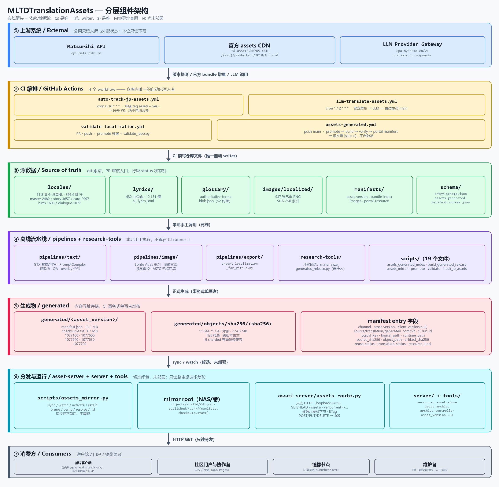
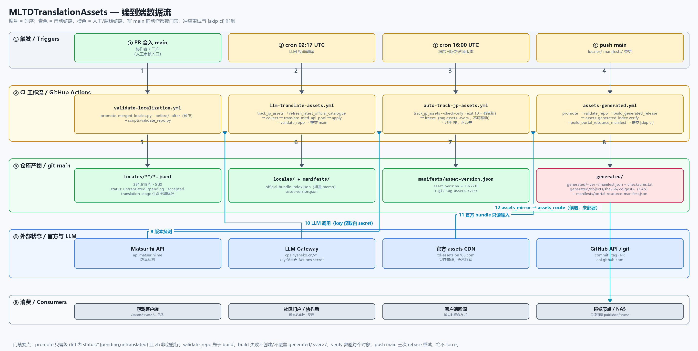
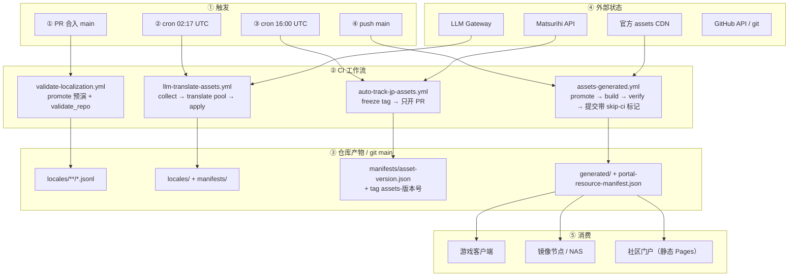
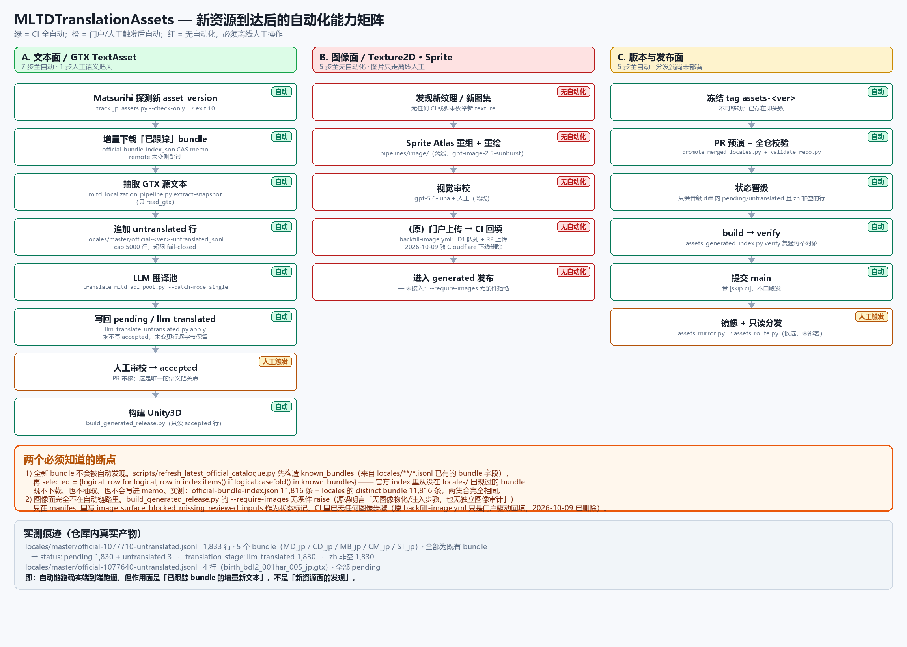

# 仓库架构（MLTDTranslationAssets）

> 生成时间：基于 `main` @ `7031e9d5`（2026-10-08）的工作树实测值；2026-10-09 移除已下线的
> Cloudflare 依赖（D1 门户索引同步、图片回填队列与 R2 发布）后复核过受影响条目。
> 本文只描述**本仓当前状态**。`local-data/`（被 `.gitignore` 忽略的本地草稿，约 117 GB）不属于仓库架构。

## 0. 一句话概括

本仓是「**可审阅的翻译源 → CI 生成 Unity3D → 内容寻址存储 → 只读分发**」的单向流水线：

- **唯一自动 writer** 是 GitHub Actions（4 个 workflow）；构建失败不会创建或覆盖 `generated/<asset_version>/`。
- **唯一内容寻址真源** 是 `generated/`（`objects/sha256/<digest>` + 每版本 `manifest.json`/`checksums.txt`）。
- 官方日版资源**不复制进 Git**，由 CI 按 `manifests/asset-version.json` 在构建时从官方 CDN 下载基线。
- 分发端（`asset-server/`、`server/`、`tools/`）是**未部署的候选闭包**，只读、逐请求复验字节哈希。

仓库规模：25,330 个被跟踪文件 · 工作树（不含 `.git` 与 `local-data/`）约 889 MB（其中 `generated/` 347 MB、`images/` 333 MB、`locales/` 191 MB）；`.git` 约 684 MB。

---

## 1. 分层组件架构

```mermaid
flowchart TB
  subgraph L1["① 上游系统 / External"]
    direction LR
    E1["Matsurihi API<br/>api.matsurihi.me"]
    E2["官方 assets CDN<br/>td-assets.bn765.com/版本/production/2018/Android"]
    E3["LLM Provider Gateway<br/>cpa.nyaneko.cn/v1"]
  end

  subgraph L2["② CI 编排 / GitHub Actions（唯一自动 writer）"]
    direction LR
    W1["auto-track-jp-assets.yml<br/>cron 0 16 * * *"]
    W2["llm-translate-assets.yml<br/>cron 17 2 * * *"]
    W3["validate-localization.yml<br/>PR / push"]
    W4["assets-generated.yml<br/>push main"]
  end

  subgraph L3["③ 源数据 / Source of truth（git 跟踪，PR 审核入口）"]
    direction LR
    S1["locales/<br/>11,818 JSONL"]
    S2["lyrics/<br/>432 曲"]
    S3["glossary/"]
    S4["images/localized/<br/>937 PNG"]
    S5["manifests/"]
    S6["schema/"]
  end

  subgraph L4["④ 离线流水线 / pipelines + research-tools（本地手工执行）"]
    direction LR
    P1["pipelines/text/"]
    P2["pipelines/image/"]
    P3["pipelines/export/"]
    P4["research-tools/<br/>迁移候选，未接入"]
    P5["scripts/（19 文件）"]
  end

  subgraph L5["⑤ 生成物 / generated（内容寻址）"]
    direction LR
    G1["generated/asset_version/<br/>manifest.json + checksums.txt"]
    G2["generated/objects/sha256/digest<br/>11,844 对象 · 274.8 MB"]
  end

  subgraph L6["⑥ 分发与运行（候选，未部署）"]
    direction LR
    V1["scripts/assets_mirror.py"]
    V2["mirror root (NAS/卷)"]
    V3["asset-server/assets_route.py<br/>只读 HTTP"]
    V4["server/ + tools/"]
  end

  subgraph L7["⑦ 消费方 / Consumers"]
    direction LR
    C1["游戏客户端"]
    C2["社区门户与协作者"]
    C3["镜像节点"]
    C4["维护者"]
  end

  L1 -->|"版本探测 / bundle 增量 / LLM 调用"| L2
  L2 -->|"CI 读写仓库文件"| L3
  L3 -->|"本地手工调用（离线）"| L4
  L4 -->|"正式生成（事务式单写者）"| L5
  L5 -->|"sync / watch"| L6
  L6 -->|"HTTP GET（只读分发）"| L7
```





---

## 2. 端到端数据流





### 主发布链路（编号即图中的时序）

| # | 动作 | 入口 |
| --- | --- | --- |
| 1–3 | 协作者/门户提 PR；日版新版本被探测 | 人工 / `scripts/track_jp_assets.py` |
| 4 | PR 预演晋级 + 全仓校验 | `scripts/promote_merged_locales.py` → `scripts/validate_repo.py` |
| 5 | 合入 `main` 后自动晋级 diff 内的 `pending/untranslated` 行 | `promote_merged_locales.py --before --after` |
| 6 | 生成 Unity3D | `scripts/build_generated_release.py` |
| 7 | 复验每个对象 | `scripts/assets_generated_index.py verify` |
| 8 | 生成门户资源清单 | `scripts/build_portal_resource_manifest.py` |
| 9 | bot 提交（含 `[skip ci]`，不自触发） | `git push origin HEAD:main`（3 次 rebase 重试） |
| 10 | 分发（**不在 Actions 内**） | `scripts/assets_mirror.py` → `asset-server/assets_route.py` |

**闭环抑制**：只有 `assets-generated.yml` 的提交带 `[skip ci]`。`llm-translate-assets.yml` 的 bot 提交**故意不带**，因此会再触发一轮 validate/build，再由 `[skip ci]` 截断。

---

## 3. 目录职责

| 目录 | 角色 | 跟踪文件 | 大小 | 主要 writer |
| --- | --- | --- | ---: | --- |
| `locales/` | 业务文本库（JSONL，单行精确定位） | 11,818 | 191 MB | PR / LLM CI / promote |
| `lyrics/` | 432 曲双语对齐歌词 | 434 | 7.5 MB | 离线流水线 |
| `glossary/` | 权威术语（90）+ 52 偶像名录 | 2 | <0.1 MB | 离线流水线 |
| `images/localized/` | 937 张已审贴图 PNG | 937 | 333 MB | 人工（离线审校后入库） |
| `manifests/` | 版本、bundle 索引、贴图清单、门户清单 | 5 | 4.1 MB | CI |
| `schema/` | `entry.schema.json`、`assets-generated-manifest.schema.json` | 2 | <0.1 MB | 人工 |
| `generated/` | 内容寻址生成物（5 个版本 + CAS） | 11,854 | 347 MB | `assets_generated_index.py` |
| `pipelines/` | 文本/图像/导出流水线（离线） | 53 | 0.7 MB | 人工 |
| `scripts/` | 产品入口脚本（10 个入口 + 9 个回归测试） | 19 | 1.4 MB | 人工 |
| `asset-server/` | 只读分发 + 镜像 compose（候选） | 10 | 0.2 MB | 人工 |
| `server/` | 版本感知 CAS 存储原语 | 7 | 0.1 MB | 人工 |
| `tools/` | 归档控制 / 物化 / 版本 CLI | 4 | 0.2 MB | 人工 |
| `research-tools/` | 中心编排迁移候选（**未接入 CI**） | 167 | 2.0 MB | 人工 |
| `.github/workflows/` | 4 个 workflow | 4 | — | 人工 |
| `configs/` | `api-models*.example.json` 模板（无密钥） | 2 | <0.1 MB | 人工 |
| `docs/` | 本文件、`GENERATED_STORE.md`、`LLM_TRANSLATION.md`、`architecture/` 图源与 PNG | 7 | 1.1 MB | 人工 |
| `local-data/` | **本地草稿，已 gitignore**（约 115 GB） | 0 | — | 本地 |

### 层的依赖方向

```
上游外部 ──▶ CI ──▶ 源数据(git) ──▶ 生成物 ──▶ 分发 ──▶ 消费
                     ▲  │
        离线流水线 ───┘  └──▶（人工/离线补写源数据）
```

`pipelines/` 与 `research-tools/` 是**离线**的：它们不跑在 CI runner 上，只在本地被维护者手工驱动，产出回写 `locales/` 等源数据后再走 CI。

---

## 4. CI 工作流矩阵

| Workflow | 触发 | concurrency | 写入 | 密钥 |
| --- | --- | --- | --- | --- |
| `auto-track-jp-assets.yml` | `cron 0 16 * * *`、dispatch | `assets-track-jp-version` (不取消) | tag `assets-<ver>`、分支 + PR | `GITHUB_TOKEN` |
| `llm-translate-assets.yml` | `cron 17 2 * * *`、dispatch | `assets-llm-translation` (不取消) | `locales/`、`asset-version.json`、`official-bundle-index.json` → `main` | `MLTD_LLM_API_KEY`、`GITHUB_TOKEN` |
| `validate-localization.yml` | PR / push（paths 过滤） | `workflow-ref`（可取消） | 无（只读校验） | 无 |
| `assets-generated.yml` | push `main`（paths 过滤）、dispatch | `assets-generated-main` (不取消) | `generated/`、`locales/`、`portal-resource-manifest.json` → `main` | 无 |

三条并发纪律：所有会写仓库状态的 workflow 都 `cancel-in-progress: false`（串行化，不中途掐断写者）；`validate-localization.yml` 是只读的，才允许取消。

### 版本跟踪与冻结

1. `track_jp_assets.py --check-only` 退出码契约：`0` = 已最新，`10` = 有新版本，**其他一律显式失败**（旧版把任何非 10 当“无更新”，一次 API 故障会被静默记为成功）。
2. 冻结「离开的那一版」为单一不可移动标签 `assets-<version>`：远端已存在且指向其他提交时**直接失败**，绝不 `--force`。该 tag 就是 `generated/<asset_version>/manifest.json` 记录的 `source_commit`。
3. 更新 `manifests/asset-version.json` 走分支 + PR，**bot 不自动合并**——`main` 的推进留给 owner/审查。

### 门禁（fail-closed）

- `promote_merged_locales.py`：`source_sha256` 必须与 `sha256(ja)` 一致，否则拒绝晋级；只处理 diff 内 `status ∈ {pending, untranslated}` 且 `zh` 非空的行，diff 外的行永不触碰。
- `validate_repo.py`：schema/必需键、`asset_version` 纯数字、`client_version is None`、禁 `base_version`、源哈希复验、保留分隔符 `|`/`^` 拦截、`accepted` 行占位符一致性；**先于** build 运行。
- `build_generated_release.py`：构建失败不创建、不覆盖 `generated/<asset_version>/`。
- `assets_generated_index.py verify`：逐对象重新哈希后才允许提交。
- 推送 `main` 一律三次 `fetch + rebase + push` 重试，**never force-push**。

---

## 5. 版本与身份模型

条目身份是**单一资产轴**上的纯数字 `asset_version`：

```json
{
  "asset_version": "1077700",
  "client_version": null,
  "source_client_version": "9.0.200",
  "bundle": "event_0448_story_06_jp.gtx",
  "item_key": "event_0448_story_06_title",
  "source_sha256": "ea4cef9f…ae7f",
  "ja": "本領発揮",
  "zh": "大显身手",
  "status": "accepted",
  "updated_at": "2026-09-27T00:00:00Z"
}
```

| 字段 | 约束 |
| --- | --- |
| `asset_version` | `^[0-9]+$`，身份本身 |
| `client_version` | 在本轴**恒为 `null`** |
| `source_client_version` | `^\d+\.\d+\.\d+$`，**仅溯源**，不参与身份 |
| `source_sha256` | 必须等于 `sha256(ja)`，防止版本漂移 |
| `zh` | `^[^\|\^]*$` —— 引擎用 `\|`/`^` 作底层控制分隔符，半角禁止 |
| `status` | `untranslated` → `pending` → `accepted` |
| `translation_stage` | `untranslated` → `llm_translated` → `human_translated` |

**禁止复合版本串**（如 `9.0.200+1077500`、`client-9.0.200-assets-1077500`）：Client 与 Assets 是两条独立发布轴，`base_version` 已废除；`track_jp_assets` 打标签前会显式拒绝复合串。

LLM 路径的策略：结果直接写 `main` 并保留 `pending` + `llm_translated`，由维护者改为 `accepted` / `human_translated`；LLM 不会覆盖 `accepted` 或既有 `pending` 行，也永不标记 `accepted`。

---

## 6. 生成物与内容寻址存储

```
generated/
├── <asset_version>/            1077100 / 1077600 / 1077640 / 1077650 / 1077700
│   ├── manifest.json           13.5 MB  · 11,817 entries
│   └── checksums.txt            1.7 MB  · 11,817 行（sha256 + object_path）
└── objects/sha256/<64hex>      11,844 个 flat CAS 对象 · 274.8 MB · 跨版本去重
```

`manifest.json` 顶层：`kind` / `schema_version` / `asset_version` / `client_version` / `source_client_version` / `source_commit` / `translation_commit` / `generated_commit` / `ci_run_id` / `build_status` / `generated_at_utc` / `entry_count` / `entries` / `reuse_summary`。

每个 entry 的字段：

| 字段 | 含义 |
| --- | --- |
| `logical_key` / `logical_path` | 逻辑名与官方逻辑路径（诊断、旧调用方） |
| `runtime_path` | 官方 `.data` 目录中的哈希文件名，**客户端实际请求的路径** |
| `object_path` | `objects/sha256/<digest>` —— 唯一权威的字节地址 |
| `source_sha256` / `translated_sha256` / `artifact_sha256` | 源 / 译文 / 落盘产物哈希 |
| `reuse_status` | `exact` / `verified-compatible` / `suggested` / `blocked` |
| `translation_status` | `modified` / `reused` / … |
| `resource_kind` | `bundle` / `other` |
| `channel` | `assets` |

对象布局：**新对象一律 flat**（`objects/sha256/<digest>`）；旧的 sharded 布局只保留**读取**兼容，不再改写、不批量迁移、不做 GC（`prune` 是单独的显式动作，`--apply` 才删）。

`assets_generated_index.py` 的 CLI 面：`build` / `verify` / `prune` / `reuse` / `list` / `check-commits`。**CI 只调用 `verify`**，其余为人工入口。

---

## 7. 分发与运行时（候选，未部署）

```
generated/ (GitHub)
   │  scripts/assets_mirror.py  sync|watch --asset-version <v>   （只同步）
   ▼
mirror root ── objects/sha256/<digest>  +  published/<ver>/{manifest,checksums,state}
   │  asset-server/assets_route.py  serve --root <mirror> --bind 127.0.0.1 --port 8765
   ▼
只读 HTTP（GET/HEAD，POST/PUT/DELETE → 405）
```

- **请求映射**：`/assets/<version|current>/[production/2018/Android/]<path>`；先按 `runtime_path` 命中，再退回 `logical_path`。历史 `/cn` overlay 桥**只有**带 `X-MLTD-Asset-Namespace: cn` 头时才启用。
- **每次响应复验字节**：读出的对象重新计算 SHA-256，与 `artifact_sha256` 不符即 404；`ETag = artifact_sha256`，`Cache-Control: public, max-age=0, must-revalidate`（逻辑 URL 不是永久不可变——同一 `asset_version` 可能收到更新译文）。
- **默认不出站**：官方回退只在显式给 `--official-base-url` / `--official-root` 时启用，且本地 root 优先；其余一律 404 fail-closed。
- **mirror 语义**：`sync`/`watch` 只同步并写入 `state.sync_status`；`activate`、`retain`/`unretain`、`prune` 是**分离的显式动作**，默认 dry-run。
- **compose 三服务**（静态模板，`ASSETS_MIRROR_VERSIONS` 缺失即拒绝启动）：`mltd-asset-tools`（profile `tools`）、`mltd-asset-updater`（`tools/archive_controller.py watch`，只管官方归档）、`mltd-assets-mirror`（`scripts/assets_mirror.py watch`）。镜像逐文件 COPY，闭包只含 `server/asset_archive.py`、`server/versioned_asset_store.py`、`tools/*.py`、`scripts/assets_generated_index.py`、`scripts/assets_mirror.py`。

`server/` + `tools/` 是上游迁入的存储核心：`VersionedAssetStore`（SQLite 目录 + `objects` CAS + `.parts/` 暂存 + `views/<ver>` 硬链接视图 + `current` 指针）、`AssetArchive`、以及 `versioned_assets.py`（`sync`/`verify`/`list`/`gc`/`serve`）、`archive_controller.py`（discover/archive/verify/materialize/activate/watch）、`asset_version.py`（`list`/`current`/`progress`/`switch`/`remote list|pull`）、`materialize_versioned_assets.py`（`materialize`/`switch-current`）。它与 `generated/` mirror 的**树完全不相交**。

---

## 8. 新资源到达后的自动化能力矩阵



回答两个高频问题：**会分析并归类最新 assets 吗？会自动提取文本/图片并翻译吗？**

### 8.1 会分析，但只分析「已跟踪的面」

| 环节 | 自动？ | 实现 |
| --- | --- | --- |
| 版本探测 | ✅ | `track_jp_assets.py --check-only`（exit 10 = 有新版本，其他退出码一律显式失败） |
| 冻结旧版标签 | ✅ | tag `assets-<ver>`，不可移动 |
| 下载官方基线 | ⚠️ **仅已跟踪 bundle** | `refresh_latest_official_catalogue.py` 先构造 `known_bundles`（来自 `locales/**/*.jsonl` 的 `bundle` 字段），再 `selected = {logical: row for logical, row in index.items() if logical.casefold() in known_bundles}` |
| 归类 / 分类 | ⚠️ **仅展示层** | `build_portal_resource_manifest.py` 的 `CATEGORY_RULES`：按 bundle 名前缀落 15 个类别（`lyrics` / `event_chat` / `event_story` / `special_commu` / `main_commu` / `card_episode` / `card_blog` / `card_skill` / `theater_comm` / `message_board` / `live_result` / `login_bonus` / `birth_live` / `birth_greet` / `system_ui`），只影响门户计数矩阵 |
| 内容类型分析（有没有图/有没有新文本面） | ❌ | CI 里没有任何 texture/sprite 扫描 |

> **断点 1：全新 bundle 不会被自动发现。** 官方 index 里从没在 `locales/` 出现过的 bundle，既不下下载、也不抽取，也不会被写进 memo（`next_bundle_index` 只保留 `downloaded` 或 remote 未变的条目）。
> 实测：`manifests/official-bundle-index.json` 有 11,816 条，`locales/` 的 distinct bundle 也是 11,816 条，**两个集合完全相同** —— 当前处于「已覆盖官方全集」状态，一旦上游出现第 11,817 个 bundle，它不会自动进入翻译队列，必须人工离线跑一次提取并落进 `locales/`。

### 8.2 会自动提取文本并自动翻译

```
官方新版本
  → ① 增量下载已跟踪 bundle        内容寻址 memo，remote 未变则跳过（冷启动/--full-rescan ≈1h，常态几分钟）
  → ② extract-snapshot 抽 GTX 文本  只 read_gtx；无 texture/sprite 抽取
  → ③ 追加 untranslated 行          locales/master/official-<ver>-untranslated.jsonl（只追加，永不覆盖）
  → ④ LLM 翻译池                     translate_mltd_api_pool.py --batch-mode single --prompt-source compiled
  → ⑤ 原地写回 pending/llm_translated 永不写 accepted；非 untranslated 行逐字节保留
  → ⑥ 提交 main（无 [skip ci]）      再触发一轮 validate + build
  → ⑦ 人工审校 → accepted           唯一的语义把关点
```

代码级边界：

- `llm_translate_untranslated.py collect` 只取 `status == "untranslated"` 且 `zh` 为空的行，并按 `source_sha256` 去重；`source_sha256 != sha256(ja)` 直接 `SystemExit`。
- `apply` 只改 `status == "untranslated"` 的行；译文含半角 `|`/`^`、或同一 source 出现两份不一致译稿，直接 `SystemExit`。
- `enforce_new_row_cap`：单次自动追加超过 `--max-new-rows`（默认 **5000**）即 fail-closed，需人工显式提高上限。
- `source_identity = (bundle, item_key, source_sha256)` **刻意不含 `asset_version`** —— 否则每次版本步进都会把全量目录重追加一遍（2026-10-01 曾因此产生约 39.3 万行与无界队列）。
- 失败语义：翻译步骤 `continue-on-error`；只有 `accepted == 0 且 failed ≥ 50` 才让 Run 变红并开 issue，少量顽固条目只 `::warning::` 并在下次重试。

实测痕迹（仓库内真实产物）：

| 文件 | 行数 | 状态 |
| --- | ---: | --- |
| `locales/master/official-1077710-untranslated.jsonl` | 1,833 | `pending` 1,830 + `untranslated` 3；`llm_translated` 1,830；5 个 bundle（`MD_jp` / `CD_jp` / `MB_jp` / `CM_jp` / `ST_jp`）**全部为既有 bundle** |
| `locales/master/official-1077640-untranslated.jsonl` | 4 | 全部 `pending` |

即：自动链路**确实端到端跑通**，但作用面是「已跟踪 bundle 的增量新文本」，**不是「新资源面的发现」**。

### 8.3 图像面完全不自动

| 环节 | 自动？ | 证据 |
| --- | --- | --- |
| 发现新纹理 / 新图集 | ❌ | 无任何 CI 可达代码枚举 texture |
| Sprite Atlas 重组 + 图像重绘 | ❌ | `pipelines/image/` 为离线人工流水线（`gpt-image-2.5-sunburst`） |
| 视觉审校 | ❌ | `gpt-5.6-luna` + 人工，离线 |
| 门户上传合成图 → CI 切回 512×512 纹理 | ❌ **已移除** | 原 `backfill-image.yml` 依赖门户 D1 队列与 R2 桶；门户静态化、Cloudflare 下线后整条链路（含 `scripts/restore/`）已删除，图片面只剩离线人工 |
| 进入 `generated/` 发布 | ❌ | `build_generated_release.py --require-images` **无条件 raise**（源码明言「无图像物化/注入步骤，也无独立图像审计」），只在 manifest 写 `image_surface: blocked_missing_reviewed_inputs` 作为状态标记 |

> **断点 2：CI 现在完全不碰图片。** 曾经的 `backfill-image.yml` 也只是「门户回填」——消费人已经在门户上传好的中文合成图，把它切回原纹理并发布，从不负责发现或重绘。随门户静态化与 Cloudflare 下线，这条链路已被整体删除，图片面只剩离线人工流水线。

### 8.4 一句话结论

| 问题 | 答案 |
| --- | --- |
| 会分析最新 assets 吗？ | 会，但**只做版本跟踪 + 已跟踪 bundle 的增量复验**；不做新面发现，不识别资源内容类型 |
| 会归类吗？ | 只有**门户展示层**按 bundle 名前缀分 15 类；翻译与构建逻辑不依赖它 |
| 会自动提取文本吗？ | 会 —— 增量下载已跟踪 bundle 并抽 GTX 文本，落到 `untranslated` 行 |
| 会自动翻译吗？ | 会 —— LLM 池自动译为 `pending` / `llm_translated` 并直接提交 `main`，人工只负责改成 `accepted` |
| 会自动提取/翻译图片吗？ | **不会** —— 无自动发现，无自动重绘，无自动注入；CI 里已无任何图片步骤 |

---

## 9. 边界与未接入项

| 项 | 状态 |
| --- | --- |
| `research-tools/` | 中心编排**迁移候选**。`materialize_generated_release.py` 每个模式（含 preflight）都强制 `--assets-writer-root` + 独立审批的 `--assets-writer-pin`；缺任一即拒绝。未接入 CI、未部署、未用生产输入跑通。 |
| `pipelines/image/` 注入器 | `stage_reviewed_images.py`（标签 `approved_for_staging_not_installed`）与 `inject_reviewed_textures.py`（只接受 `user_approved_for_isolated_install_staging`）**标签不兼容**，中间缺 source-bound 桥接；注入器/审计器**未接入** `build_generated_release`（`--require-images` 仍 fail-closed）。 |
| 镜像与服务 | 只有 `asset-server/` 的 compose 模板，**没有任何 workflow 调用 `assets_mirror.py`**；生产切换（NAS 指向、单写者交接）未做。 |
| `manifests/images.manifest.json` 的 `distribution` | 只保留 GitHub Release 的 `url_template`（2026-10-09 删除了失效的 `cloudflare_r2` 指针），但**没有 workflow 发布 GitHub Release**，只是外链指针。 |
| `local-data/` | 117 GB 本地草稿（含历史 `build/`、`work/`、APK jadx 审计等），已 gitignore，非架构组成。 |
| `docs/GENERATED_STORE.md` | 记录了 writer 回归迁移的**一条未决红项**（`test_a_retained_sharded_manifest_verifies_without_rewriting` 的 notes 措辞期待 `shard`，writer 实际写 `retired fan-out`），移交后续对齐。 |

---

## 10. 回归入口（全部离线）

```bash
# 生成物 writer + 只读路由 + 存储核心
python -m pytest scripts/test_assets_mirror.py server/tests asset-server/ -q

# writer 独立 suite（只读三个产品文件，fixture 自建临时目录）
python -X utf8 -B scripts/test_assets_generated_index.py

# 单个入口的契约测试
python -m pytest scripts/ -q
python -m pytest pipelines/image/test_image_injection_contract.py -q   # 需 numpy/Pillow/UnityPy
```

`scripts/` 内有 9 个 `test_*.py`；`research-tools/scripts/` 另有大量研究级测试，但按 `research-tools/README.md` 的约定**不属于维护中的产品回归**。

---

## 11. 架构不变式（改动时不得破坏）

1. **单写者**：`generated/<asset_version>/` 只能由 `scripts/assets_generated_index.py` 事务式写入；失败不得留下半成品。
2. **单轴身份**：`asset_version` 纯数字；`client_version` 恒 `null`；禁止任何复合版本串。冻结标签不可移动。
3. **源绑定**：`source_sha256 == sha256(ja)`；译文不得含半角 `|` / `^`。
4. **先验后建**：`validate_repo.py` 在 build 之前；`verify` 在提交之前。
5. **不可变优先 + 显式动作**：mirror 只同步；`activate`/`prune` 默认 dry-run 且需显式 `--apply`。
6. **默认不出站、默认 fail-closed**：分发端缺 manifest/state/校验不符一律 404，官方回退必须显式开启。
7. **凭据零落盘**：仓库只含 `*.example.json`；密钥仅经环境变量或 Actions secret 注入一次性运行期文件，永不提交、不进日志。
